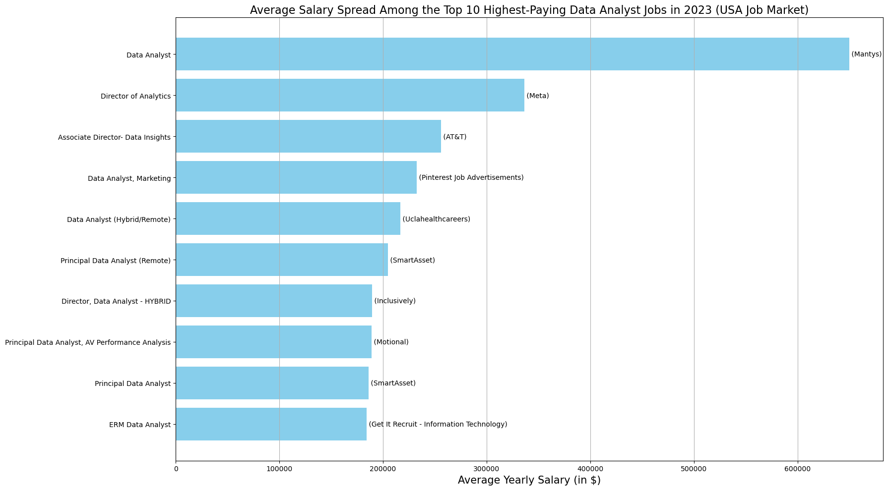

# Introduction
SQL is indispensable for data management and analysis in today's applications and businesses, offering simplicity, compatibility, scalability, integrity, security, and robust querying. Learning SQL is essential for aspiring data analysts. Leveraging on the  dataset provided by lukebarousse, this project delves into 2023 job postings for various data-related roles. It tackles critical data analytics inquiries: top-paying jobs, sought-after skills, and the relationship between demand and salary. Explore the SQL queries driving these insights at [SQL_JOB_POSTINGS_PROJECT](/SQL_JOB_POSTINGS_PROJECT/).
# Background
- Such an enriching dataset can be used to answer various questions related to several roles; with this desire in mind, this project aims to answer questions such as top-paid jobs and in-demand skills for the role of a data analyst.
- Data hails from [SQL_COURSE](https://www.lukebarousse.com/sql). It has insights into job titles, salaries, locations, and essential skills.

## The Questions I wanted to answer through my SQL Queries were:
 1. What are the top-paying data analyst jobs?
 2. What skills are required for these top-paying jobs?
 3. What skills are most in demand for data analysts?
 4. Which skills are associated with higher salaries?
 5. What are the most optimal skills to learn?

# Tools USED
- **MY SQL Workbench**: The cornerstone of my analysis, enabling me to query the database and unveil pivotal insights.
- **Git & GitHub**: Essential for sharing my SQL scripts and analysis.

# Analysis
Each query in this project was designed to explore particular aspects of the data analyst job market. Here's my approach to each question

### 1. Top Paying Data Analyst Jobs

To pinpoint the top-paying roles, I filtered data analyst positions by average yearly salary and location. This query illuminates lucrative opportunities in the field.

``` sql
SELECT	
	job_id,
	job_title,
	job_location,
	job_schedule_type,
	salary_year_avg,
	job_posted_date,
    name AS company_name
FROM
    job_postings_fact
LEFT JOIN company_dim ON job_postings_fact.company_id = company_dim.company_id
WHERE
    job_title_short = 'Data Analyst' AND 
    job_location = 'Anywhere' AND 
    salary_year_avg IS NOT NULL
ORDER BY
    salary_year_avg DESC
LIMIT 10;
```

Here are observations from the top 10 data analyst job roles based on salary in 2023

* **Salary Range Variation**: The top 10 highest-paying data analyst roles in 2023 offer a wide salary range, ranging from $184,000 to $650,000. This underscores the significant earning potential within the field.

* **Diverse Employers**: Major companies such as SmartAsset, Meta, and AT&T offer lucrative salaries, highlighting the diverse range of employers across various industries that value data analytics expertise.

* **Job Title Diversity**: The job titles within the top-paying data analyst roles vary greatly, ranging from Data Analyst to Director of Analytics. This diversity reflects the broad spectrum of roles and specializations available within the field of data analytics.

  
### 2. Skills for Top Paying Jobs
To grasp the essential skills for the highest-paying positions, I merged job postings with skill data, offering insights into the attributes that employers prioritize for well-compensated roles.
``` SQL
SELECT 
    sjd.job_id,
    sd.skills,
    sd.type,
    cd.name,
    jpf.salary_year_avg,
    jpf.job_title_short
FROM
    skills_job_dim AS sjd
        INNER JOIN
    job_postings_fact AS jpf ON jpf.job_id = sjd.job_id
        INNER JOIN
    skills_dim AS sd ON sd.skill_id = sjd.skill_id
        INNER JOIN
    company_dim AS cd ON cd.company_id = jpf.company_id
WHERE
    jpf.job_title_short = 'Data Analyst'
        AND jpf.salary_year_avg IS NOT NULL
        AND jpf.job_location = 'Anywhere'
ORDER BY jpf.salary_year_avg DESC
LIMIT 10;
```

### 3. In-Demand Skills for Data Analysts
``` SQL
SELECT 
    skills, COUNT(skills_job_dim.job_id) AS demand_count
FROM
    job_postings_fact
        INNER JOIN
    skills_job_dim ON job_postings_fact.job_id = skills_job_dim.job_id
        INNER JOIN
    skills_dim ON skills_job_dim.skill_id = skills_dim.skill_id
WHERE
    job_title_short = 'Data Analyst'
GROUP BY skills
ORDER BY demand_count DESC
LIMIT 5;
```
### 4. Skills Based on Salary

```sql
SELECT 
    skills,
    ROUND(AVG(salary_year_avg), 0) AS avg_salary,
    COUNT(skills_job_dim.job_id) AS demand_count
FROM
    job_postings_fact
        INNER JOIN
    skills_job_dim ON job_postings_fact.job_id = skills_job_dim.job_id
        INNER JOIN
    skills_dim ON skills_job_dim.skill_id = skills_dim.skill_id
WHERE
    job_title_short = 'Data Analyst'
        AND salary_year_avg IS NOT NULL
GROUP BY skills
ORDER BY demand_count DESC , avg_salary DESC
LIMIT 25;
```
### 5. Most Optimal Skills to Learn
``` sql
SELECT 
    skills_dim.skill_id,
    skills_dim.skills,
    COUNT(skills_job_dim.job_id) AS demand_count,
    ROUND(AVG(job_postings_fact.salary_year_avg),
            0) AS avg_salary
FROM
    job_postings_fact
        INNER JOIN
    skills_job_dim ON skills_job_dim.job_id = job_postings_fact.job_id
        INNER JOIN
    skills_dim ON skills_job_dim.skill_id = skills_dim.skill_id
WHERE
    job_title_short = 'Data Analyst'
        AND salary_year_avg IS NOT NULL
GROUP BY skills_dim.skill_id
HAVING COUNT(skills_job_dim.job_id) > 10
ORDER BY avg_salary DESC , demand_count DESC;
```

# What I Learned
In my journey, I've ramped up my SQL arsenal with formidable skills:

**Advanced Query Crafting**: Expertly merge tables and utilize WITH clauses for sophisticated temp table operations.

**Data Aggregation**: Mastered GROUP BY and wild aggregate functions like COUNT() and AVG() to summarize data effectively.

**Analytical Mastery**: Elevated my problem-solving abilities, transforming inquiries into actionable SQL solutions that provide valuable insights.

### Closing Remarks
This project has been instrumental in elevating my SQL expertise and offering profound insights into the data analyst job landscape. The analysis outcomes serve as a compass for directing skill enhancement and job pursuit endeavours. Aspiring data analysts can strategically navigate a competitive job market by honing sought-after, high-paying skills. This journey underscores the significance of perpetual learning and staying attuned to evolving trends within the realm of data analytics.
